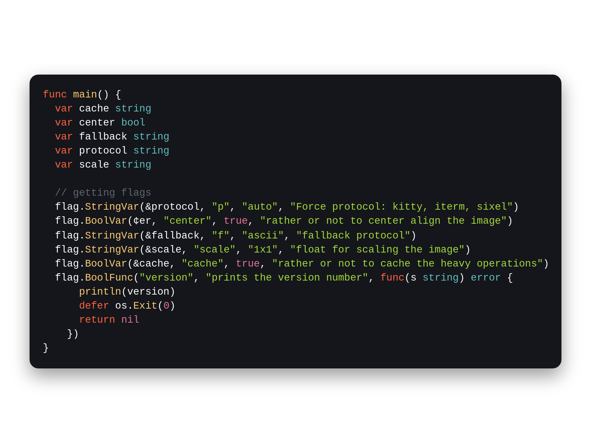

# Makurai Autumn Theme

## Syntax Colors
| Name      | Color          | |
|-----------|----------------|-|
| Keyword   | `#ff6340` |  |
| Function  | `#facc75` |  |
| String    | `#a2d93d` |  |
| Type      | `#60bfbf` |  |
| Constant  | `#e67399` |  |
| Comment   | `#5C6773` |  |
| Foreground| `#FFFFFF` |  |
| Error     | `#fc4c4c` |  |

## ANSI Colors
| Name    | Color                              |                                                       |
| ------- | ---------------------------------- | ----------------------------------------------------- |
| Black   | `#2e3339`   |      |
| Red     | `#fc4c4c`     |          |
| Green   | `#a2d93d`   |      |
| Yellow  | `#facc75`  |    |
| Blue    | `#60bfbf`    |        |
| Magenta | `#e67399` |  |
| Cyan    | `#60bfbf`    |        |
| White   | `#FFFFFF`   |      |

## UI Colors
| Name          | Color           | |
|---------------|-----------------|-|
| Background    | `#15161B` |  |
| Surface       | `#22202a` |  |
| Background 2  | `` |  |
| Surface 2     | `` |  |
| Border        | `#4a5868` |  |

## Other
| Name         | Color           | |
|--------------|-----------------|-|
| Line Number  | `#34383d` |  |
| Cursor Line  | `#1E1F24` |  |
| Selection    | `#602c3d` |  |
| On_Selection | `#ffffff` |  |
| Cursor       | `#ffdb29` |  |