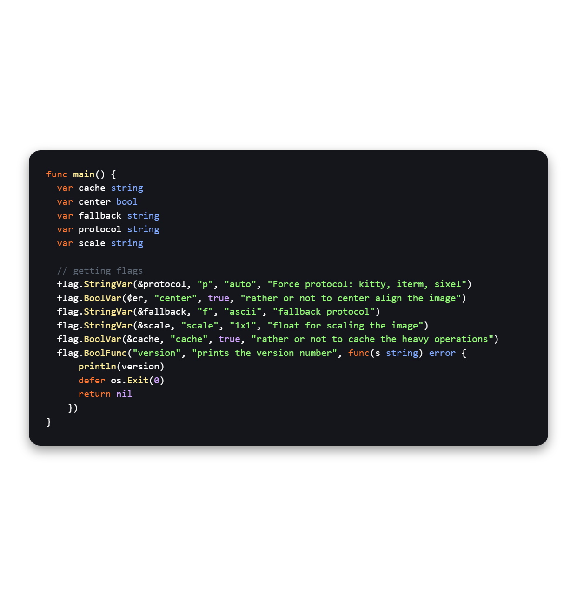

# Makurai Dark Theme

## Syntax Colors
| Name      | Color          | |
|-----------|----------------|-|
| Keyword   | `#FF7733` |  |
| Function  | `#FFEE99` |  |
| String    | `#95FB79` |  |
| Type      | `#82AAFF` |  |
| Constant  | `#D2A6FF` |  |
| Comment   | `#5C6773` |  |
| Foreground| `#FFFFFF` |  |
| Error     | `#FF5555` |  |

## ANSI Colors
| Name    | Color                              |                                                       |
| ------- | ---------------------------------- | ----------------------------------------------------- |
| Black   | `#2e3339`   |      |
| Red     | `#FF5555`     |          |
| Green   | `#95FB79`   |      |
| Yellow  | `#FFEE99`  |    |
| Blue    | `#82AAFF`    |        |
| Magenta | `#D2A6FF` |  |
| Cyan    | `#82AAFF`    |        |
| White   | `#FFFFFF`   |      |

## UI Colors
| Name          | Color           | |
|---------------|-----------------|-|
| Background    | `#15161B` |  |
| Surface       | `#262831` |  |
| Border        | `#4a5868` |  |

## Other
| Name         | Color           | |
|--------------|-----------------|-|
| Line Number  | `#34383d` |  |
| Cursor Line  | `#1E1F24` |  |
| Selection    | `#264F78` |  |
| On_Selection | `#ffffff` |  |
| Cursor       | `#ffdb29` |  |