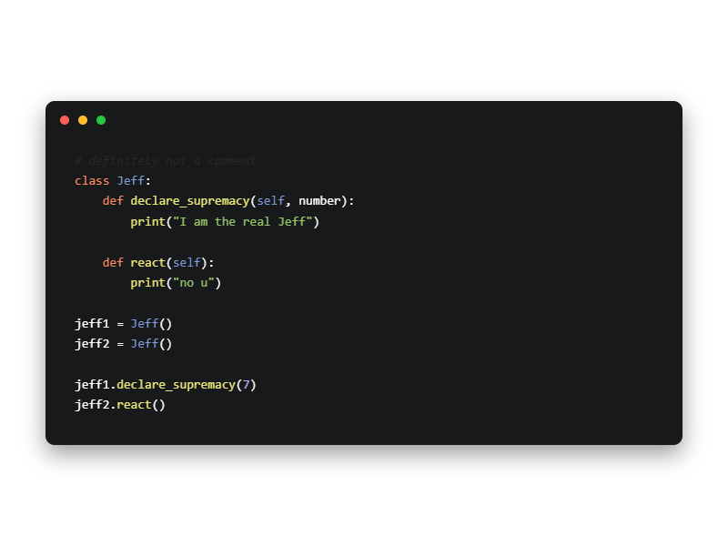

# Makurai Druid Theme

## Syntax Colors
| Name      | Color          | |
|-----------|----------------|-|
| Keyword   | `#FF875F` |  |
| Function  | `#EAE87A` |  |
| String    | `#92c468` |  |
| Type      | `#7C9EDB` |  |
| Constant  | `#D2A6FF` |  |
| Comment   | `#6C6C6C` |  |
| Foreground| `#FFFFFF` |  |
| Error     | `#FF5555` |  |

## UI Colors
| Name          | Color           | |
|---------------|-----------------|-|
| Background    | `#18191B` |  |
| Surface       | `#080808` |  |
| Background 2  | `#1C1C1C` |  |
| Surface 2     | `#262626` |  |
| Border        | `#AFAFD7` |  |

## Other
| Name         | Color           | |
|--------------|-----------------|-|
| Line Number  | `#262626` |  |
| Cursor Line  | `#262623` |  |
| Selection    | `#2D4A6F` |  |
| On_Selection | `#ffffff` |  |
| Cursor       | `#ffdb29` |  |