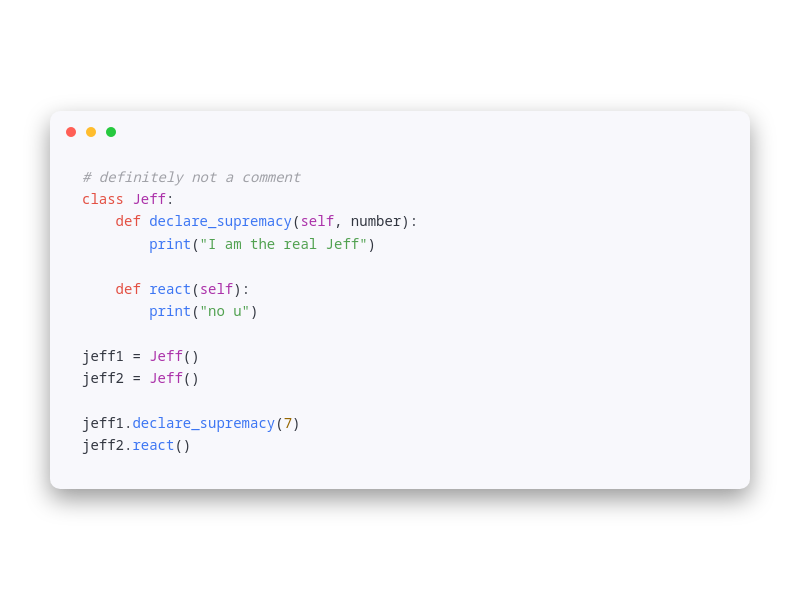

# Makurai Healer Theme

## Syntax Colors
| Name      | Color          | |
|-----------|----------------|-|
| Keyword   | `#E35043` |  |
| Function  | `#3D76F3` |  |
| String    | `#51A150` |  |
| Type      | `#AB31A9` |  |
| Constant  | `#976700` |  |
| Comment   | `#A0A1A7` |  |
| Foreground| `#323640` |  |

## UI Colors
| Name          | Color           | |
|---------------|-----------------|-|
| Background    | `#f8f8fc` |  |
| Surface       | `#ececf2` |  |
| Background 2  | `#ebebf4` |  |
| Surface 2     | `#f0f0f9` |  |
| Border        | `#7e8a9e` |  |

## Other
| Name         | Color           | |
|--------------|-----------------|-|
| Line Number  | `#3D76F3` |  |
| Cursor Line  | `#f0f0fa` |  |
| Selection    | `#C6DBFF` |  |
| On_Selection | `#323640` |  |
| Error        | `#CC0000` |  |
| Cursor       | `#D4A017` |  |