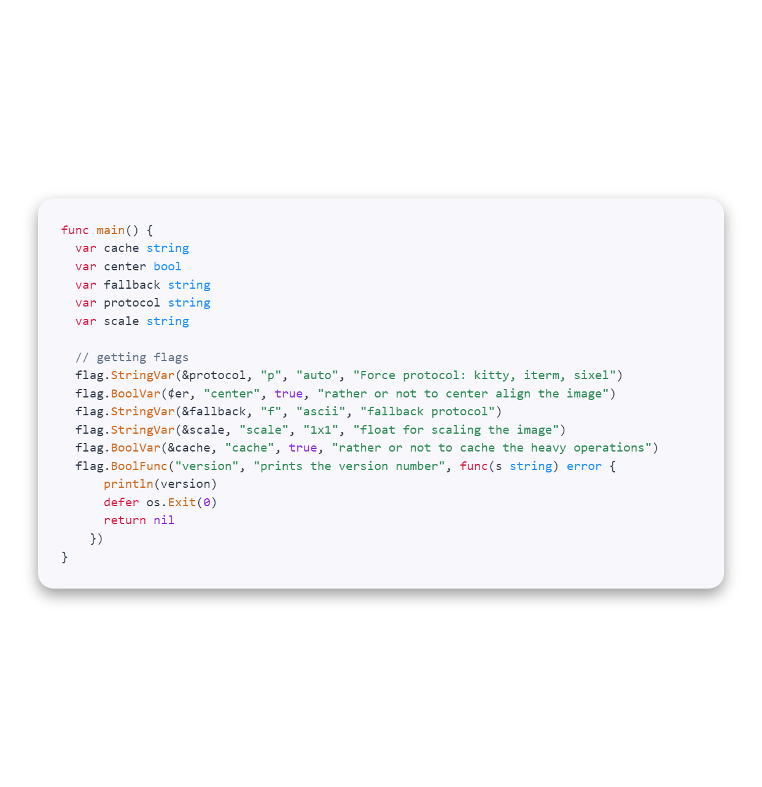

# Makurai Light Theme

## Syntax Colors
| Name      | Color          | |
|-----------|----------------|-|
| Keyword   | `#DC143C` |  |
| Function  | `#D2691E` |  |
| String    | `#2E8B57` |  |
| Type      | `#1E90FF` |  |
| Constant  | `#8A2BE2` |  |
| Comment   | `#64748b` |  |
| Foreground| `#2D3748` |  |
| Error     | `#CC0000` |  |

## ANSI Colors
| Name    | Color                              |                                                       |
| ------- | ---------------------------------- | ----------------------------------------------------- |
| Black   | `#7c7c7d`   |      |
| Red     | `#DC143C`     |          |
| Green   | `#2E8B57`   |      |
| Yellow  | `#D2691E`  |    |
| Blue    | `#1E90FF`    |        |
| Magenta | `#8A2BE2` |  |
| Cyan    | `#1E90FF`    |        |
| White   | `#586c8d`   |      |

## UI Colors
| Name          | Color           | |
|---------------|-----------------|-|
| Background    | `#f8f8fc` |  |
| Surface       | `#ececf2` |  |
| Background 2  | `` |  |
| Surface 2     | `` |  |
| Border        | `#A0AEC0` |  |

## Other
| Name         | Color           | |
|--------------|-----------------|-|
| Line Number  | `#718096` |  |
| Cursor Line  | `#f0f0fa` |  |
| Selection    | `#C6DBFF` |  |
| On_Selection | `#2D3748` |  |
| Cursor       | `#D4A017` |  |