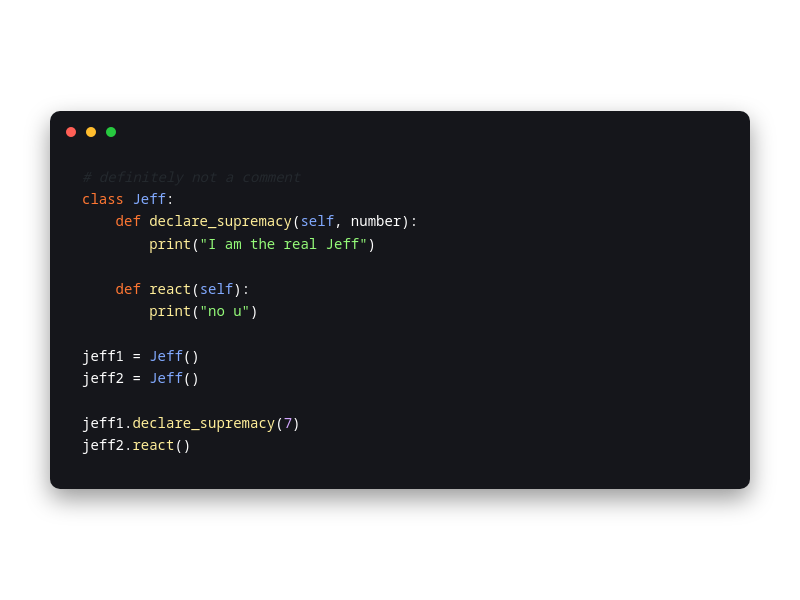

# Makurai Mage Theme

## Syntax Colors
| Name      | Color          | Preview |
|-----------|----------------|---------|
| Keyword   | `#FF7733` |  |
| Function  | `#FFEE99` |  |
| String    | `#95FB79` |  |
| Type      | `#82AAFF` |  |
| Constant  | `#D2A6FF` |  |
| Comment   | `#5C6773` |  |
| Foreground| `#FFFFFF` |  |

## UI Colors
| Name          | Color           | Preview |
|---------------|-----------------|---------|
| Background    | `#15161B` |  |
| Surface       | `#08090D` |  |
| Background 2  | `#14161f` |  |
| Surface 2     | `#20202b` |  |
| Border        | `#A6ACCD` |  |

## Other
| Name         | Color           | Preview |
|--------------|-----------------|---------|
| Line Number  | `#25282E` |  |
| Cursor Line  | `#1E1F24` |  |
| Selection    | `#264F78` |  |
| On_Selection | `#ffffff` |  |
| Error        | `#FF5555` |  |
| Cursor       | `#ffdb29` |  |