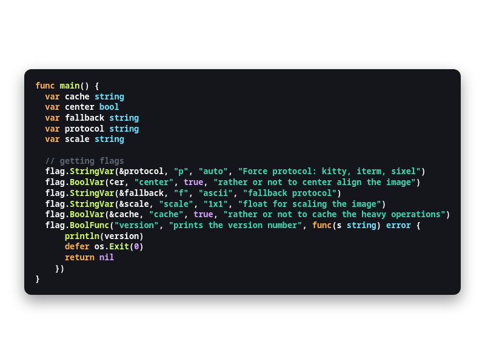

# Makurai Spring Theme

## Syntax Colors
| Name      | Color          | |
|-----------|----------------|-|
| Keyword   | `#FFB347` |  |
| Function  | `#D4FF59` |  |
| String    | `#8CEB3A` |  |
| Type      | `#66E6FF` |  |
| Constant  | `#D8A5FF` |  |
| Comment   | `#5C6773` |  |
| Foreground| `#FFFFFF` |  |
| Error     | `#FF5555` |  |

## ANSI Colors
| Name    | Color                              |                                                       |
| ------- | ---------------------------------- | ----------------------------------------------------- |
| Black   | `#2e3339`   |      |
| Red     | `#FF5555`     |          |
| Green   | `#D4FF59`   |      |
| Yellow  | `#FFB347`  |    |
| Blue    | `#66E6FF`    |        |
| Magenta | `#D2A6FF` |  |
| Cyan    | `#66E6FF`    |        |
| White   | `#FFFFFF`   |      |

## UI Colors
| Name          | Color           | |
|---------------|-----------------|-|
| Background    | `#15161B` |  |
| Surface       | `#08090D` |  |
| Background 2  | `#14161f` |  |
| Surface 2     | `#1C1F2E` |  |
| Border        | `#A6ACCD` |  |

## Other
| Name         | Color           | |
|--------------|-----------------|-|
| Line Number  | `#25282E` |  |
| Cursor Line  | `#1E1F24` |  |
| Selection    | `#264F78` |  |
| On_Selection | `#ffffff` |  |
| Cursor       | `#ffdb29` |  |